# CPP-DSA-and-OOPs
A collection of 22 C++ programs demonstrating OOP, data structures, and core algorithms. Covers Stack, Queue &amp; Circular Queue implementations, recursive Factorial, Fibonacci &amp; Tower of Hanoi, sorting algorithms, matrix multiplication, string manipulation engines, and array processing utilities.

# CPP-Programming-Portfolio

A comprehensive collection of 22 C++ programs covering core object-oriented structures, fundamental algorithms, and abstract data types. This repository includes practical implementations of linear data structures, string parsing engines, recursion, and sorting models.

---

# C++ Programming Portfolio: Algorithms, Data Structures & OOP

- **Object-Oriented Design:** Every program is architected around class encapsulation, inheritance hierarchies, and constructor-driven initialization, reflecting real-world modular software design principles.
- **Abstract Data Structures:** Hands-on implementations of Stack, Queue, and Circular Queue using bounded arrays with full overflow/underflow guard logic and pointer-tracked state management.
- **Recursive Problem Decomposition:** Factorial, Fibonacci, and Tower of Hanoi solutions demonstrate divide-and-conquer strategies, call-stack mechanics, and exponential trace tree modeling.
- **String & Array Processing Engines:** Multiple programs exercise raw character buffer iteration, sliding-window transformations, in-place reversal algorithms, and manual index-tracking techniques without relying on high-level STL abstractions.
- **Sorting & Search Algorithms:** Selection Sort, Bubble Sort, linear second-maximum detection, and dynamic insertion showcasing classical algorithm design with hands-on time-complexity awareness.

---

## 📋 Program Index

| # | Program Description | Key Features | Visual Output |
| :--- | :--- | :--- | :--- |
| 1 | **Matrix Pattern Formats** — Prints three distinct output patterns using stream width formatting and fill characters | Matrix alignment via `setw` / `setfill` stream manipulators; nested loop triangle and alternating border patterns | 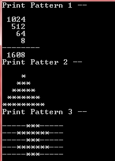 |
| 2 | **GCD & Digit Parity Checker** — Computes the Greatest Common Divisor of two integers and separately counts and sums even and odd digits of a number | Iterative GCD via divisibility scanning; digit extraction using modulo and integer division loops | 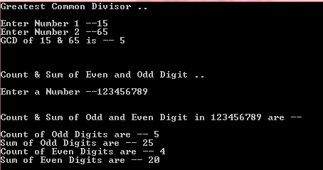 |
| 3 | **Symmetrical Padded Boundary Grids** — Renders a diamond-shaped numeric grid with alternating `0` and `9` fill values and shrinking/expanding row widths | Nested loop controls with dynamic column and space counters; conditional ternary formatting for interior fill values | 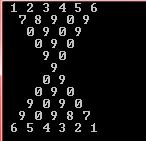 |
| 4 | **Summation Series Polynomials** — Interactive menu to print Series 1 (`i × i`) or Series 2 (cumulative additive rows) up to the Nth term with total sum | User-selectable series via `getch()`; Series 1 computes squared terms; Series 2 builds additive prefix-sum rows with inline equation display | 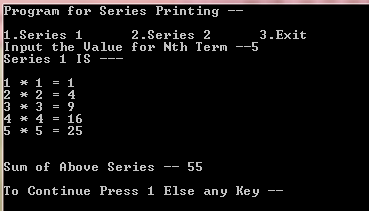 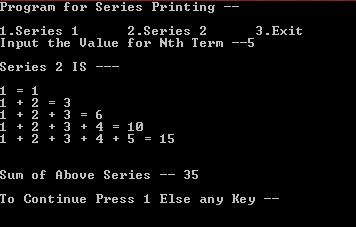 |
| 5 | **Substring Generation Module** — Generates all substrings of a given string both with `std::substr` and via manual character concatenation | Dual O(N²) nested loop implementations; manual index tracking vs. standard library `substr`; demonstrates equivalence of both approaches | 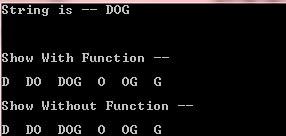 |
| 6 | **Phrase-Level Word Reversal Engine** — Reverses the word order of a sentence using three methods: manual buffer insertion, `stringstream`, and pure loop logic | String buffer prepend via `insert(0, ...)`; `stringstream` tokenization; pure character-level word extraction and reconstruction without STL functions | 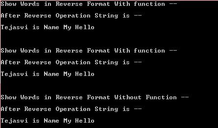 |
| 7 | **In-Place Character Inversion Passes** — Reverses individual characters within each word of a sentence using `std::reverse`, manual stringstream reversal, and a fully loop-based approach | Bidirectional iterator usage via `reverse()`; character prepend loop for manual reversal; pure nested loop approach with no STL dependencies | 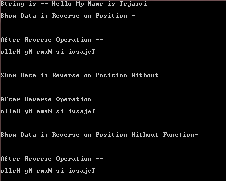 |
| 8 | **Linear Array Secondary Maximum Tracker** — Accepts up to 10 array elements and identifies the second largest value in a single traversal | Single-pass linear scan with dual-max tracking at O(N); handles edge cases where max and second-max are adjacent in value | 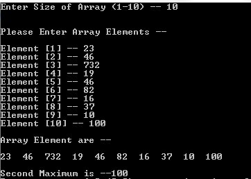 |
| 9 | **Runtime Array Index Element Insertion** — Inserts a new element into a user-specified position within an existing array by dynamically shifting elements rightward | Position-validated insertion with `goto`-based re-entry on invalid input; right-shift loop to create insertion slot; runtime array size expansion | 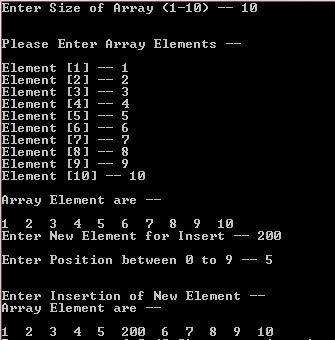 |
| 10 | **Selection & Bubble Sort Implementations** — Offers a menu-driven choice between Selection Sort and Bubble Sort on a user-defined integer array | User-selectable sort routine via `getch()`; Selection Sort via nested index comparison; Bubble Sort with adjacent swap passes; pre/post display of array state | 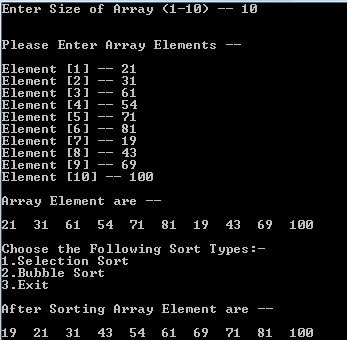 |
| 11 | **2D Matrix Multiplication Engine** — Multiplies two user-defined matrices of up to 3×3 dimensions after validating dimensional compatibility | Dimension compatibility check (`C1 == R2`); triple nested loop matrix multiplication at O(N³); separate input, display, and multiply methods for clean OOP separation | 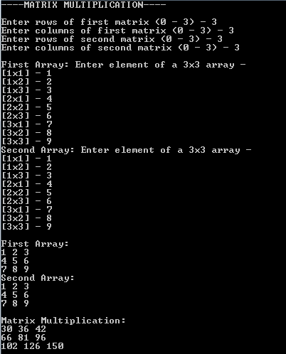 |
| 12 | **Numerical Digit Sequence Slicing** — Converts an integer to a string and prints all contiguous digit substrings in sliding-window order | Integer-to-string conversion via `to_string()`; nested loop substring accumulation using string concatenation; sliding window traversal over digit characters | 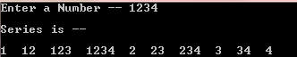 |
| 13 | **Proportional Character ASCII Histogram** — Reads a string and prints each character followed by a `*` symbol positioned at the column equal to its uppercase ASCII offset | Explicit byte-value casting from `char` to `int`; `toupper` normalization; `setw`-based positional star rendering for each non-space character | 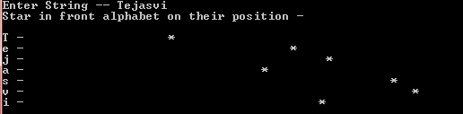 |
| 14 | **Binary String to Base-10 Integer Converter** — Accepts a binary number as a string and converts it to its decimal equivalent using positional bit-weight accumulation | Right-to-left bit traversal with `pow(2, position)` weighting; character-to-integer conversion via ASCII offset subtraction; constructor-driven single-pass computation | 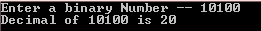 |
| 15 | **Integrated Prime Component Multiplier** — Accepts a 4-digit integer, extracts each digit, identifies the prime ones, and returns their product using an inheritance-based class design | Base class stores input value; derived class performs digit extraction and primality testing via trial division; validates 4-digit constraint before computation | 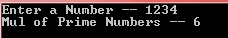 |
| 16 | **Password Multi-Layer Complexity Validator** — Evaluates a hardcoded password string against five security rules: uppercase, lowercase, digit, special character presence, and minimum length | Boolean flag state machine over character classification functions (`isupper`, `islower`, `isdigit`, `ispunct`, `isspace`); all conditions must pass for "Perfect" verdict |  |
| 17 | **Sentenced Integer Extraction Filter** — Parses a sentence containing embedded integers and computes their total sum by isolating and accumulating digit sequences | Alphanumeric character scan with multi-digit number assembly via `n = n * 10 + digit`; automatic flush-and-reset on non-digit characters | 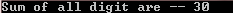 |
| 18 | **Adjacent Index Coordinate Swapping** — Reads a number, stores its digits in a heap-allocated array, swaps each adjacent pair, and reconstructs the modified integer | Dynamic array allocation via `new int[]`; pairwise index swap with step-2 loop; digit-array to integer reconstruction via positional multiplication | 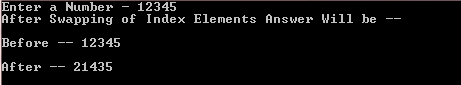 |
| 19 | **Recursive Tree Mechanics & Trace Matrices** — Menu-driven program implementing Factorial, Fibonacci series, and Tower of Hanoi using pure recursion | Recursive factorial with base case `n==1`; memoization-free Fibonacci via binary recursion tree; Tower of Hanoi with three-peg character labels and disk-count input from 3–6 | 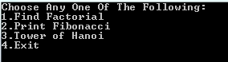 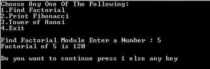 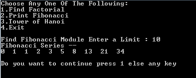 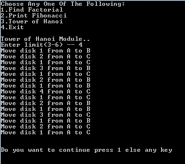 |
| 20 | **Linear Bounded FIFO Queue Register** — Array-based Queue with Push, Pop, and Peek operations; handles overflow/underflow and supports front-shifting on rear overflow | Sequential index advancing with front-pointer shifting on rear saturation; overflow guard on full queue; underflow guard on empty pop; linked menu loop with continue prompt |     |
| 21 | **Ring-Buffer Circular Queue Logic** — Circular Queue implementation using wrap-around index logic to efficiently reuse vacated front slots without shifting elements | Modular rear wrap-around when `Rear == MaxSize-1 && Front != 0`; full-queue detection via `Front == 0 && Rear == MaxSize-1`; circular Peek traversal with break-on-rear logic |     |
| 22 | **Bounded LIFO Stack Memory Registry** — Array-based Stack with Push, Pop, and Peek operations implementing classic last-in-first-out semantics with top-of-stack pointer tracking | `TOP` pointer initialized to `-1` for empty state; overflow check against `MaxSize-1`; Pop zeroes slot before decrementing `TOP`; Peek traverses from `TOP` downward to index `0` |     |

---

## 🚀 Getting Started

1. **Clone the Repository:**
```bash
git clone https://github.com/your-username/your-repo-name.git
cd your-repo-name
```

2. **Compiler:** Ensure you have a working C++ compiler installed (e.g., GCC/g++).

3. **Compile & Run:**
```bash
g++ filename.cpp -o output
./output
```

> *Note: Legacy platform headers like `<conio.h>` and terminal directives like `system("cls")` are configured for native Windows compilation environments. On Linux/macOS, replace `getch()` with standard `cin` input and remove or stub out `system("cls")` calls for cross-platform compatibility.*

---

## 🗂️ Repository Structure

```
📦 CPP-Programming-Portfolio
 ┣ 📂 screenshots/          ← Output screenshots for each program
 ┣ 📄 Ass1akaq8.cpp         ← Q8:  Pattern Formats
 ┣ 📄 Ass2_aka_q16.cpp      ← Q16: GCD & Digit Parity
 ┣ 📄 Ass3_aka_q18.cpp      ← Q18: Boundary Grid Pattern
 ┣ 📄 Ass4_aka_Q21.cpp      ← Q21: Series Polynomials
 ┣ 📄 Ass5akaQ22.cpp        ← Q22: Substring Generator
 ┣ 📄 Ass6akaQ23.cpp        ← Q23: Word Reversal Engine
 ┣ 📄 Ass7akaQ24.cpp        ← Q24: Character Inversion
 ┣ 📄 Ass8akaq25.cpp        ← Q25: Second Maximum Tracker
 ┣ 📄 Ass9akaq26.cpp        ← Q26: Array Insertion
 ┣ 📄 Ass10akaq27.cpp       ← Q27: Selection & Bubble Sort
 ┣ 📄 Ass11aka29.cpp        ← Q29: Matrix Multiplication
 ┣ 📄 Ass12akaQ33.cpp       ← Q33: Digit Sequence Slicer
 ┣ 📄 Ass13akaQ35.cpp       ← Q35: ASCII Histogram
 ┣ 📄 Ass14akaQ45.cpp       ← Q45: Binary to Decimal
 ┣ 📄 Ass15_aka_Q52.cpp     ← Q52: Prime Digit Multiplier
 ┣ 📄 Ass16akaQ58.cpp       ← Q58: Password Validator
 ┣ 📄 Ass17akaQ61.cpp       ← Q61: Integer Extraction Filter
 ┣ 📄 Ass18akaQ63.cpp       ← Q63: Adjacent Digit Swapper
 ┣ 📄 Ass19.cpp             ← Recursion: Factorial, Fibonacci, Tower of Hanoi
 ┣ 📄 Ass20AkaQ77.cpp       ← Q77: Linear FIFO Queue
 ┣ 📄 CircularQueue.cpp     ← Circular Queue Implementation
 ┗ 📄 Stack.cpp             ← LIFO Stack Implementation
```

